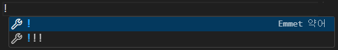
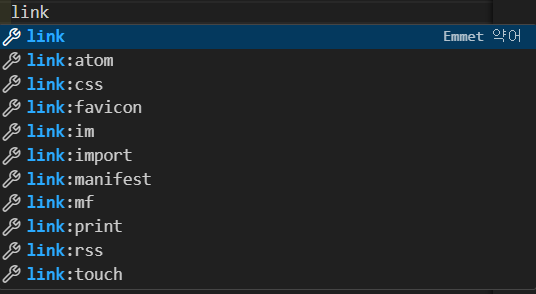
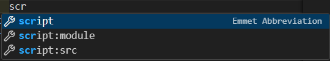

# 그림판 구현 01 - CANVAS 라이브러리 기본 알아보기

## CANVAS Library

- 참고자료 01 - [CANVAS 라이브러리 공식문서](https://developer.mozilla.org/ko/docs/Web/API/Canvas_API/Tutorial/Basic_usage)
- 참고자료 02 - [무료강의](https://nomadcoders.co/javascript-for-beginners-2/lobby)


캔버스 라이브러리 공식문서와 무료강의의 내용을 통해 그림판 그현을 공부해보았습니다.

### Live Server, Live Preview
자바스크립트의 실행화면 확인을 위한 익스텐션을 설치해주세요!
html 파일에서 마우스 우클릭 -> Open with live Server
를 이용하면 새로고침 없이 코드가 변할때마다 실시간으로 바뀌는 화면을 볼 수 있습니다.

### 기본 구현
우선 index.html, style.css, app.js 파일을 준비합니다.
1. index.html
    1. `!`를 입력하면
    
    이렇게 나오는데 이때, !를 클릭하거나 enter 혹은 tab키를 눌러서 자동완성시킬 수 있습니다.

    2. title의 밑 부분에 위와 같이 `link` 를 입력하면
    
    라고 나옵니다. 여기선 `link:css`를 선택해줍니다.

    3. body 태그 내부에 `<canvas></canvas>`를 입력해줍니다.

    4. 그 밑에 `scr` 를 입력하고
    
    `script:src`를 선택해서 `app.js`를 입력해줍니다.

    완성 코드
    ```html
    <!DOCTYPE html>
    <html lang="en">
    <head>
        <meta charset="UTF-8">
        <meta name="viewport" content="width=device-width, initial-scale=1.0">
        <title>Document</title>
        <link rel="stylesheet" href="style.css">
    </head>
    <body>
        <canvas></canvas>
        <script src="app.js"></script>
    </body>
    </html>
    ```


2. style.css
    기본 스타일을 지정해줍니다.
    강의 교안을 따랐습니다.
    ```css
    canvas {
        width: 800px;
        height: 800px;
        border: 1px solid black;
    }

    body {
        display: flex;
        justify-content: center;
        align-items: center;
    }
    ```

3. app.js
    이제 남은 모든 것은 자바스크립트 파일에서 이루어집니다.
    시작하기 전에 붓과 캔버스를 불러와주고 캔버스의 크기를 설정하겠습니다.
    ```javascript
    // 캔버스 불러오기
    const canvas = document.querySelector("canvas");
    // 붓(커서) 설정
    const ctx = canvas.getContext("2d");
    // 캔버스 크기 설정
    canvas.width = 800;
    canvas.height = 800;
    ```

### moveTo 와 lineTo 이해하기 
우선, canvas의 동작은 canvas내부의 커서가 있는 개념으로 이해하면 됩니다.
마우스와는 별개의 커서이기 때문에, 마우스 클릭 혹은 이동시에 이벤트를 호출하여 마우스 위치로 canvas내부 커서 위치를 이동시켜 줘야한다 라고 생각하면 편합니다.

1. moveTo(x, y) : canvas 내부 커서의 위치를 이동시킵니다.
2. lineTo(x, y) : canvas 내부 커서의 위치로 부터 원하는 위치까지 선을 그립니다. -> 경로를 만든다 라고 생각해야합니다.
3. fill() : 만들어진 경로 내부의 색을 채웁니다.
4. stroke() : 만들어진 경로를 선으로 그립니다.

<hr/>

1. 사각형 만들기 1

    이를 이용해서 사각형을 만들어보겠습니다.

    ```javascript
    // app.js
    ctx.moveTo(50, 50);
    ctx.lineTo(150, 50);
    ctx.lineTo(150, 250);
    ctx.lineTo(50, 250);
    ctx.lineTo(50, 50);
    ctx.stroke();
    ```

    이렇게 하면 속이 빈 사각형 하나가 만들어집니다.
    구현방식 : 커서를 (50, 50)으로 옮기고 lineTo()를 따라서 경로를 만들고 stroke()를 따라서 선을 그려줍니다.

    > 속을 채우려면 ? -> ctx.stroke() 대신에 ctx.fill() 을 사용한다!

2. 사각형 만들기 2
    사실 사각형을 만드는 내부함수가 있습니다.
    위의 예시는 중요하게 쓰일 lineTo와 moveTo에 대한 이해를 위해 만들어보았습니다.

    ```javascript
    ctx.fillRect(50, 50, 100, 200)
    ctx.strokeRect(300, 300, 100, 200)
    ```

    위의 코드를 통해, 칠해진 사각형과 빈 사각형을 모두 만들 수 있습니다.

3. 예시01 - 집 만들기
    도형들을 묶어 간단한 그림을 그려봅니다.

    ```javascript
    ctx.fillRect(200, 200, 50, 200);
    ctx.fillRect(400, 200, 50, 200);
    ctx.fillRect(300, 300, 50, 100);
    ctx.fillRect(200, 200, 200, 20);
    ctx.moveTo(200, 200);
    ctx.lineTo(325, 100);
    ctx.lineTo(450, 200);
    ctx.fill();
    ```

4. 예시02 - 사람그리기
    ctx.arc(x, y, radius, startAngle, endAngle, counterClockwise?)라는 새로운 method가 나옵니다.
    원을 그려주는 method입니다.

    ```javascript
    // 변수들을 바꾸어가며 .arc()의 실행방식을 익혀봅시다.
    ctx.arc(100, 100, 20, 0, 2*Math.PI);
    ```

    사람그리기!

    ```javascript
    ctx.fillRect(190, 170, 15, 100)
    ctx.fillRect(310, 170, 15, 100)
    ctx.fillRect(220, 170, 60, 200)

    ctx.arc(250, 100, 50, 0, 2 * Math.PI); 
    ctx.fill()

    ctx.beginPath();   // 중요!!
    ctx.fillStyle = "red";
    ctx.arc(270, 80, 8, 0, 2 * Math.PI);  
    ctx.arc(230, 80, 8, 0, 2 * Math.PI);
    ctx.fill()
    ```

    > `beginPath()`란?? -> 색을 변경하거나, 선의 굵기 등 스타일요소들을 바꾸어줄 때, 이전의 경로들을 초기화하고, 앞으로의 경로들에 대해서만 적용해주기 위해 사용하는 메소드